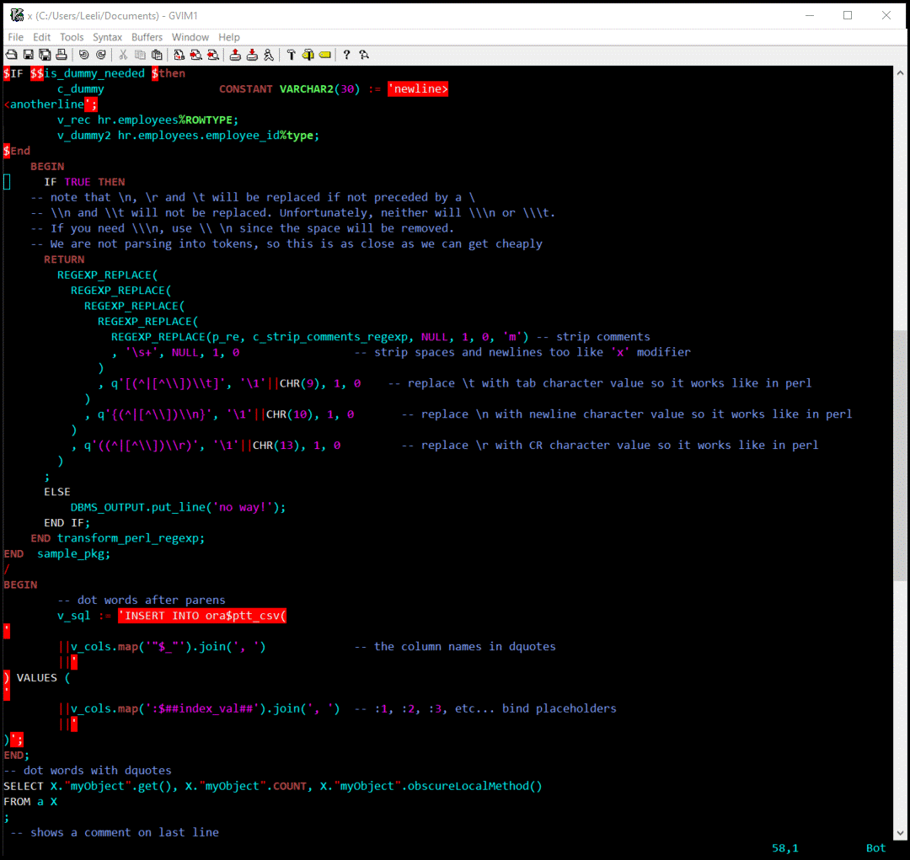

# vim_plsql_syntax

Repository includes

    syntax/plsql.vim
    colors/lee.vim

## plsql.vim syntax file

The syntax file replaces the functionality of the *plsql.vim* file that ships with vim (it was last updated
for Oracle 9). This update adds keywords and syntax through Oracle version 19c.

It also fixes q-quote operator syntax, exponential notation and assorted oddities. It does away
with trying to separate SQL from PL/SQL keywords unless *plsql_legacy_sql_keywords* is set.

## lee.vim color file

The colors file *lee.vim* is a black background with shades of bold green for the various oracle keyword types, orangish
for quoted literals and numbers, yellowish green for operators and bright yellow for punctuation. Your program method
and variable names are cyan. Comments are white and in italic font.

*lee.vim* provides separate
colors for Numbers/Boolean, Constant (strings) and Character (double quoted names) while the common color files
combine them.

*lee.vim* folds *Repeat* and *Conditional* groups into *Statement* while the common color files show them in a
different color.

## New PL/SQL syntax file with *lee.vim* color file


| Screenshots |
|:--:|
|  |
|  |

## New PL/SQL syntax file (not legacy) with *elflord.vim* color file

SQL and PL/SQL keywords are all the same color. You can choose separate colors for Oracle
Reserved keywords from Oracle non-Reserved keywords if desired (Statement, Keyword), but we do not try to
separate SQL and PL/SQL keywords. It was not done with much attention to detail originally, and
seems more distracting than useful. See next section if you prefer the legacy behavior.

| Screenshots |
|:--:|
|  |
|  |

## Original PL/SQL syntax file with *elflord.vim* color file

Notice the distinction between some SQL keywords and others. 

| Screenshots |
|:--:|
|  |
|  |

## New PL/SQL syntax file using legacy setting with *elflord.vim* color file

Much of it matches up with the original with better parsing of literals and
support for more Oracle syntax and keywords.

```vim
:let plsql_legacy_sql_keywords = 1
" then to reload it...
:set filetype=plsql
```

| Screenshots |
|:--:|
|  |
|  |

# Installation

The files are placed under your home directory. Do not put them in the common location under Program Files or /usr/local/share
because those can be clobbered by a reinstall or upgrade of vim.

If you are on Unix, create directories *~/.vim/syntax* and *~/.vim/colors* if they do not already exist. On windows it is your
%USERPROFILE% folder (usually C:\Users\YourLoginName) and below that *vimfiles/syntax*, *vimfiles/colors*.

These configuration files can be used independently. *plsql.vim* works just fine with *elflord* and other
color schemes that ship with vim. *lee.vim* uses more colors for more syntax distinctions. You may find that distracting
and choose to collapse the various Oracle keyword types into a single color

You might want to add the following to your *.vimrc* (or *_vimrc* file on windows):

```vim
syntax enable
colorscheme lee
au BufNewFile,BufRead *.sql,*.pls,*.tps,*.tpb,*.pks,*.pkb,*.pkg,*.trg syntax on
au BufNewFile,BufRead *.sql,*.pls,*.tps,*.tpb,*.pks,*.pkb,*.pkg,*.trg set filetype=plsql
```

The [manual page](https://vimhelp.org/syntax.txt.html#%3Asyn-files) may be helpful. See
*MAKING YOUR OWN SYNTAX FILES*.

