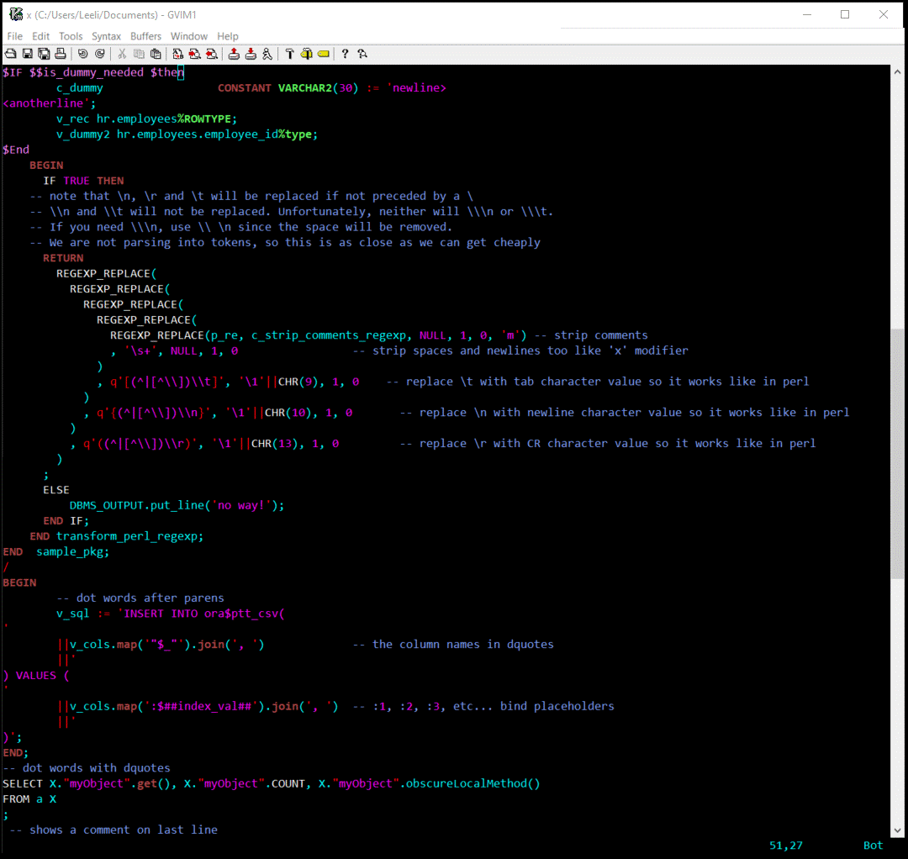

# vim_plsql_syntax

Repository includes

    syntax/plsql.vim
    colors/lee.vim

The syntax file replaces the functionality of the *plsql.vim* file that ships with vim (it was last updated
for Oracle 9). This update adds keywords and syntax through Oracle version 19c.

The colors file *lee.vim* is a black background with shades of bold green for the various oracle keyword types, orangish
for quoted literals and numbers, yellowish green for operators and bright yellow for punctuation. Your program method
and variable names are cyan. Comments are white and in italic font.

## New syntax file with *lee.vim* color file

| Screenshots |
|:--:|
|  |
|  |

## Original syntax file with *elflord.vim* color file

| Screenshots |
|:--:|
|  |
|  |

## New syntax file using legacy setting with *elflord.vim* color file

```vim
:let plsql_legacy_sql_keywords = 1
" then to reload it...
:set filetype=plsql
```

| Screenshots |
|:--:|
|  |
|  |

## New syntax file (not legacy) with *elflord.vim* color file

```vim
:unlet plsql_legacy_sql_keywords 
" then to reload it...
:set filetype=plsql
```
| Screenshots |
|:--:|
|  |
|  |


# Installation

The files are placed under your home directory. Do not put them in the common location under Program Files or /usr/local/share
because those can be clobbered by a reinstall or upgrade of vim.

If you are on Unix, create directories *~/.vim/syntax* and *~/.vim/colors* if they do not already exist. On windows it is your
%USERPROFILE% folder (usually C:\Users\YourLoginName) and below that *vimfiles/syntax*, *vimfiles/colors*.

These configuration files can be used independently. *plsql.vim* works just fine with *elflord* and other
color schemes that ship with vim. *lee.vim* uses more colors for more syntax distinctions. You may find that distracting
and choose to collapse the various Oracle keyword types into a single color

You might want to add the following to your *.vimrc* (or *_vimrc* file on windows):

```vim
syntax enable
colorschem lee
au BufNewFile,BufRead *.sql,*.pls,*.tps,*.tpb,*.pks,*.pkb,*.pkg,*.trg syntax on
au BufNewFile,BufRead *.sql,*.pls,*.tps,*.tpb,*.pks,*.pkb,*.pkg,*.trg set filetype=plsql
```

The [manual page](https://vimhelp.org/syntax.txt.html#%3Asyn-files) may be helpful. See
*MAKING YOUR OWN SYNTAX FILES*.

