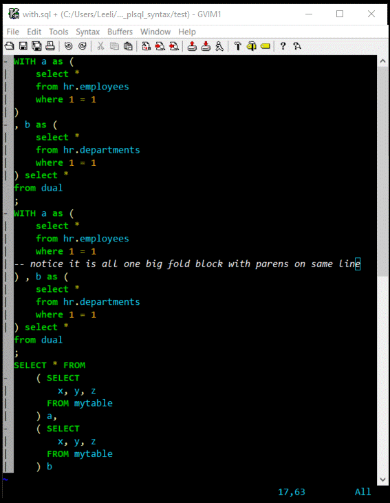
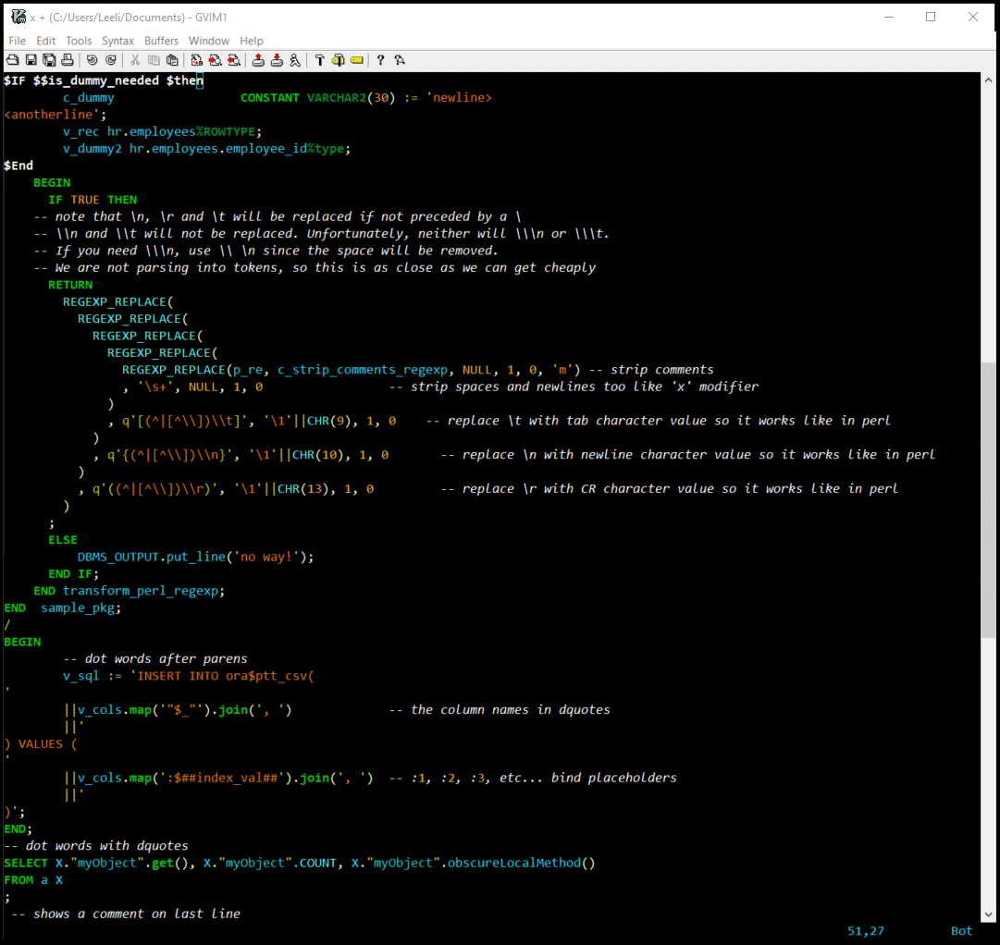
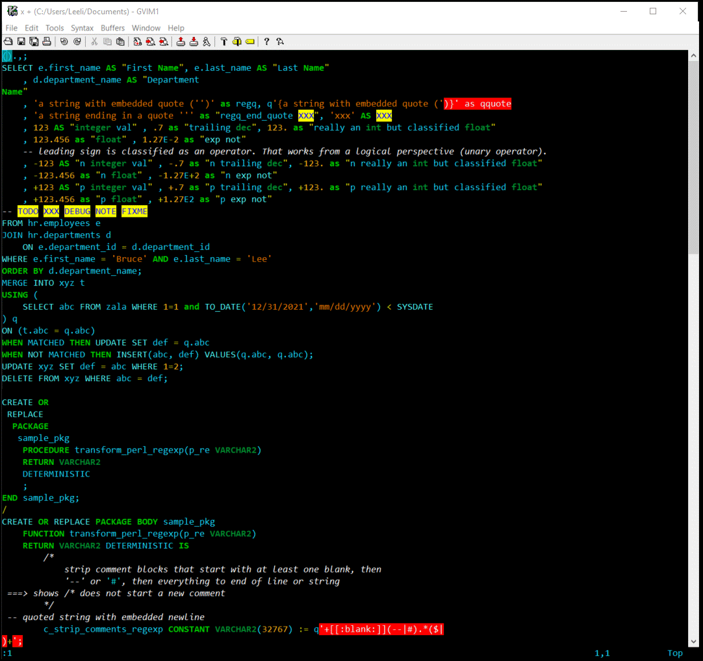
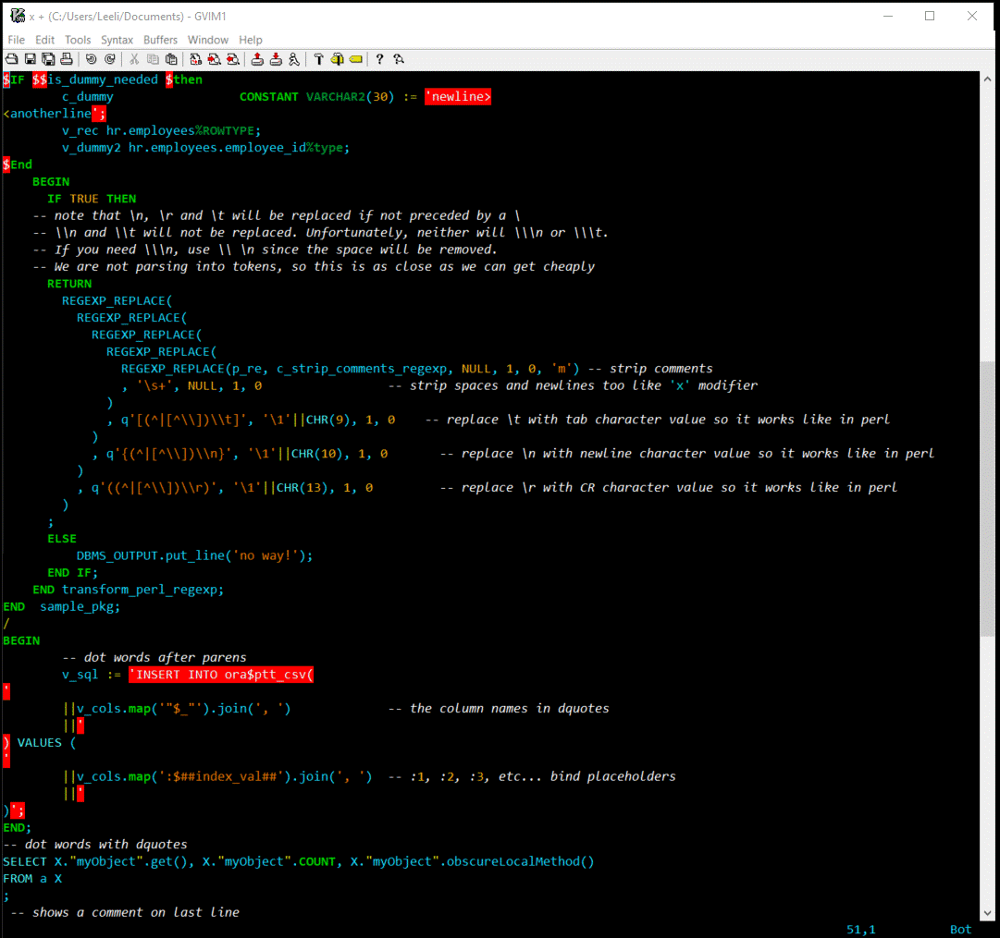
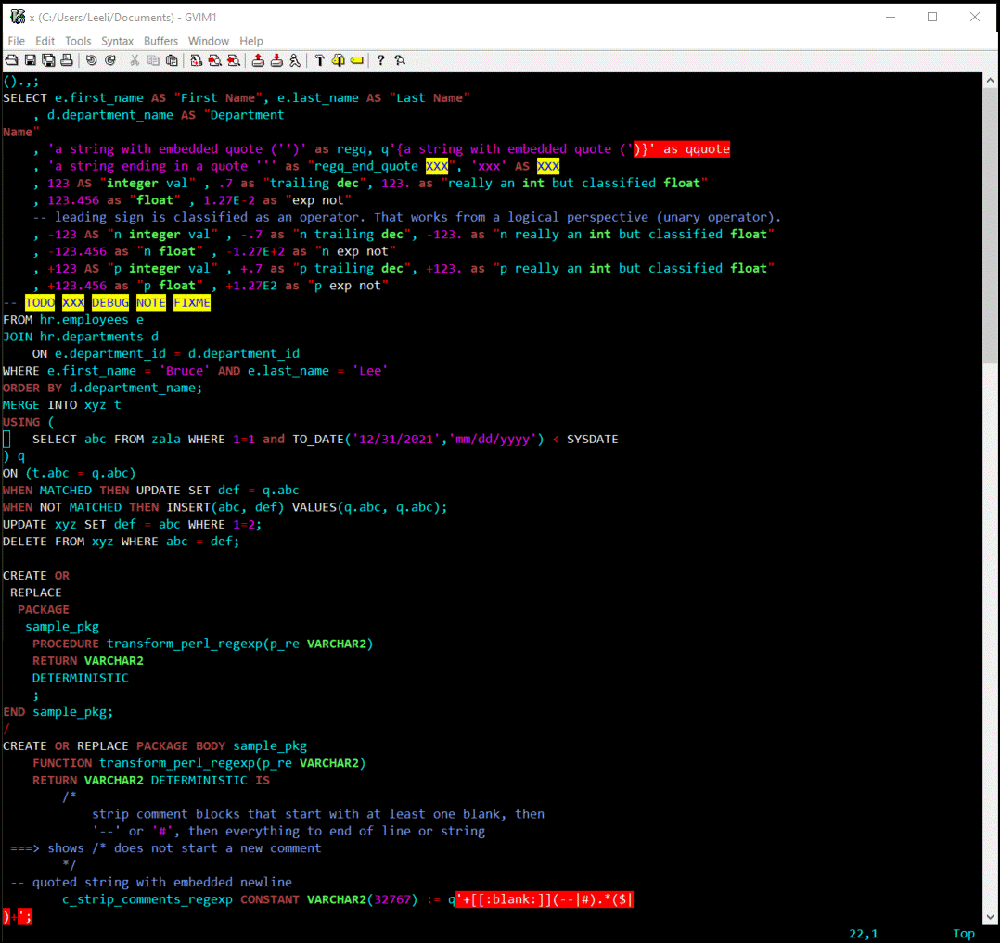
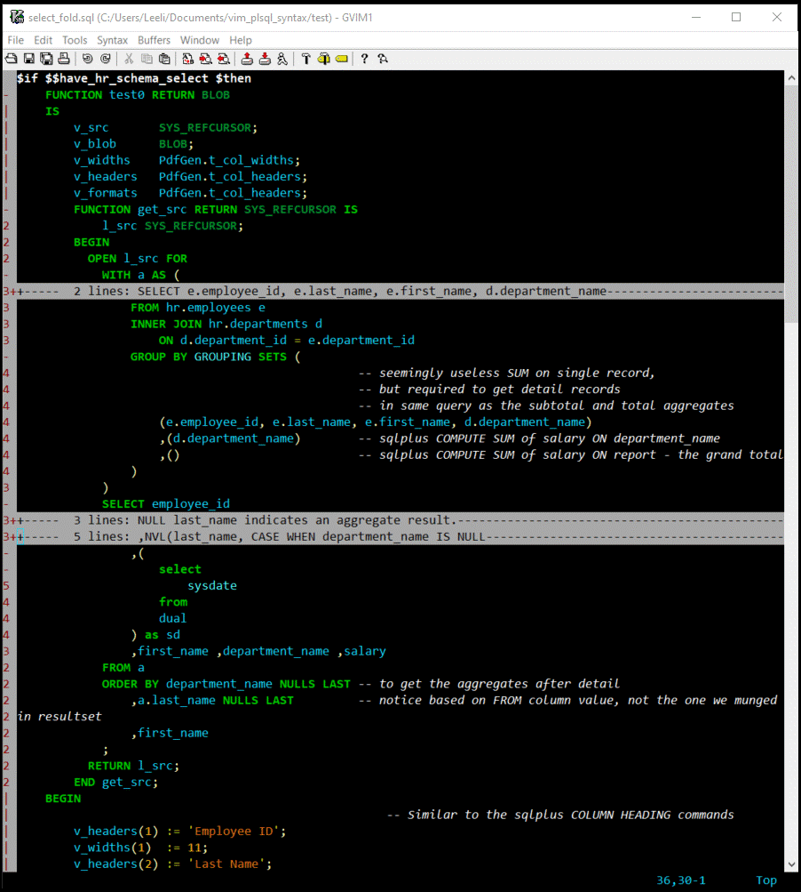

# vim_plsql_syntax

Provides for syntax highlighting of Oracle SQL and PL/SQL files in *vim*.

Repository includes

    syntax/plsql.vim
    colors/lee.vim

[Syntax Highlighting for PL/SQL in vim](https://lee-lindley.github.io/oracle/plsql/sql/vim/2022/04/29/vim-plsql-syntax.html) 
describes how I came to create this repository.

## Content

- [plsql.vim syntax file](#plsqlvim-syntax-file)
    - [Folding](#folding)
        - [Procedures and Functions](#procedures-and-functions)
        - [Parentheses Folding](#parentheses-folding)
        - [*SELECT*/*FROM* Folding](#selectfrom-folding)
        - [*UPDATE/MERGE SET* Folding](#updatemerge-set-folding)
- [lee.vim color file](#leevim-color-file)
- [Screenshots](#screenshots)
    - [New PL/SQL syntax file with *lee.vim* color file](#new-plsql-syntax-file-with-leevim-color-file)
    - [Original PL/SQL syntax file with *lee.vim* color file](#original-plsql-syntax-file-with-leevim-color-file)
    - [New PL/SQL syntax file using legacy setting with *lee.vim* color file](#new-plsql-syntax-file-using-legacy-setting-with-leevim-color-file)
    - [New PL/SQL syntax file with *elflord.vim* color file](#new-plsql-syntax-file-with-elflordvim-color-file)
    - [Original PL/SQL syntax file with *elflord.vim* color file](#original-plsql-syntax-file-with-elflordvim-color-file)
    - [New PL/SQL syntax file using legacy setting with *elflord.vim* color file](#new-plsql-syntax-file-using-legacy-setting-with-elflordvim-color-file)
    - [New PL/SQL syntax file with *ron.vim* color file](#new-plsql-syntax-file-with-ronvim-color-file)
    - [Original PL/SQL syntax file with *ron.vim* color file](#original-plsql-syntax-file-with-ronvim-color-file)
    - [New PL/SQL syntax file using legacy setting with *ron.vim* color file](#new-plsql-syntax-file-using-legacy-setting-with-ronvim-color-file)
    - [Screenshot Demonstrating Fold Column](#screenshot-demonstrating-fold-column)
- [Installation](#installation)


## plsql.vim syntax file

The syntax file replaces the functionality of the *plsql.vim* file that ships with vim (it was last updated
for Oracle 9). 

> Release v20220503_1.3 (tag r1.3) of this syntax file was submitted to the *vim* maintainers for inclusion in *vim* version 9.

> Release v20220821_1.4 (tag r1.4) of this syntax file was submitted to the *vim* maintainers for inclusion in *vim* version 9.

Relative to the original *plsql.vim*, this update adds keywords and syntax through Oracle version 19c.
It fixes Q-quote operator syntax, exponential notation and assorted oddities, plus 
adds optional folding.

It does away
with trying to separate SQL from PL/SQL keywords unless *plsql_legacy_sql_keywords* is set.

Behavior was changed for highlight groups *plsqlSymbol* and *plsqlSQLKeyword*. If you want the
original behavior, add the following to your *.vimrc* file:

```vim
let plsql_legacy_sql_keywords = 1
```

### Folding

To turn on syntax folding, issue the following commands to enable folding and reload the syntax file:

```vim
:let plsql_fold = 1
:set syntax=plsql
```

If you habitually do not put the procedure/function name in the *END* statement of the definition,
you might want to disable folding for procedures with:

```vim
:let plsql_disable_procedure_fold = 1
:set syntax=plsql
```

The reason is that it will search to the end of the file on each procedure/function declaration looking for it.
On a large file without the procedure name in closing END statement searching to the end for each match can be expensive.

In the [Installation](#installation) section there are some suggestions for your *.vimrc* file, including how to turn
on folding automatically without having to open all folds every time you open a file.

Folding is defined for

* PROCEDURE/FUNCTION
* multi-line comments
* multi-line string literals including those created with the Q-quote operator
* BEGIN ... END; blocks including those that encompass the body of a procedure if the procedure is not matched
* CASE ... END conditional blocks, both SQL and PL/SQL (END CASE;)
* IF ... END IF; conditional blocks
* LOOP ... END LOOP; repeat blocks
* CURSOR ... ;
* ( ... ) parentheses groups
* *SELECT* ... *FROM* 
* *UPDATE/MERGE SET* assignments

#### Procedures and Functions Folding

Folding for Procedures and Functions is limited. It only works if the *END* statement includes the procedure/function 
name before the semicolon. Although Oracle makes it optional, we cannot. If you do not have the procedure/function
name in the *END* statement, you can still fold the *BEGIN/END* block that comprises the procedure body, but
the specification part will not fold.

One tricky thing about folding Procedures and Functions, is that if your cursor is on the top line
and on that line there is an opening paren for a multi-line paren group (method parameters), and you do **zc**, 
the paren group will fold first.
You must move your cursor below the closing paren to fold the Procedure/Function or else use **zC** to fold both.

Independent *BEGIN/END* blocks inside the procedure body cannot fold. 
If *plsqlBlock* was contained in *plsqlProcedure*, it would start at the *BEGIN* keyword of the Procedure and consume
it along with the *END* keyword. There does not appear to be any way to make them coexist using
methods I tried.

Local Procedures and Functions in the specification (between *IS* (or *AS*) and *BEGIN*) can fold if they
meet the other criteria (named *END* statement). Unlike the outer Procedure/Function, an unmatched local
method cannot fold on the *BEGIN/END* pair.

#### Parentheses Folding

One nice thing about parentheses folding is that it can work on SQL *WITH* clauses

```plsql
WITH a AS (
    SELECT
        x, y, z
    FROM mytable
)
, b AS (
    SELECT
        x, y, z
    FROM mytable
)
SELECT * from a,b
;
```

The line beginning "WITH a AS (" through the line containing ")" will fold. The line containing ",b AS ("
through the line containing ")" will fold.

> if you put both the closing paren of the first *WITH* clause (aka Common Table Expression or *CTE*),
> and the opening paren of the next *CTE* on the same line, then it lumps it all into a single fold block. Too bad.

This also works with the old style Oracle inline views with the same caveat about closing and opening
parens needing to be on separate lines.

For this screenshot *foldcolumn* is set to 2. You can see on the left where folds can be done and what
is included in the fold.

| Screenshot 1 - SQL View folding |
|:--:|
|  |

#### *SELECT*/*FROM* Folding

If *FROM* is on a line that starts only with white space, then it will not be included in the fold. If *FROM*
is on the same line with something inside the select list, it will be scooped up into the fold (which is probably
not what you want).
In the preferred case only the line with *SELECT* and all lines up until the line with *FROM* will fold. 
*SELECT*/*FROM* pairs in column list scalar subqueries will be consumed recursively and can fold as well (though
it seems unlikely you would want to considering you are returning a single value in the select list).

As with the example in [Parentheses Folding](#parentheses-folding), if the *SELECT* keyword shares a line
with a prior foldable end match, such as a closing paren, then it will collapse with it into
a single fold. That makes this example ugly:

```plsql
WITH a AS (
    SELECT ...
    FROM abc
    WHERE ...
) SELECT     abc
            ,def
            ,ghi
FROM a;
```
If you fold the Parentheses group starting on any line,
it will fold everything up until the bottom *FROM* as it consumes the second logical fold group (SELECT/FROM)
along with the Parentheses group.

#### *UPDATE/MERGE SET* Folding

The comma separated list of assignments after the *SET* keyword, whether in an *UPDATE* statement or
in the *WHEN NOT MATCHED THEN UPDATE* section of a *MERGE*, can be a long list. We can
fold the assignments.

Other components of a *MERGE* are inside parentheses which can be folded.

If the term that ends the *SET* assignments is on a separate line, then it is not included in the fold.
This is similar to the discussion about *FROM* in [*SELECT*/*FROM* Folding](#selectfrom-folding).

## lee.vim color file

The colors file *lee.vim* is a Black background theme.

*lee.vim* provides separate
colors for *Numbers* and *Boolean*, *Constant* (strings) and *Character* (double quoted identifiers) while the common color files
combine them. 

> The rational for separating *Character* to a different color is that double quoted literal strings are mapped to *Character*.
> Double Quoted literals in SQL are identifiers (object names) that are case sensitive and may contain spaces. Since they are really
> table and column names, or column aliases, in your program rather than string literal data, they deserve a color
> closer to what you use for *Normal*. *lee.vim* makes them Cyan which is close to the Electric Blue of *Normal*.

*lee.vim* folds *Repeat* and *Conditional* groups into *Statement* while the common color files show them in a
different color.

I use the same color scheme via 
a [ruby-rouge plsql lexer](https://lee-lindley.github.io/plsql/sql/2022/03/20/Ruby-Rouge-Lexer-PLSQL.html) 
in [my blog](https://lee-lindley.github.io/).

## Screenshots

### New PL/SQL syntax file with *lee.vim* color file

SQL and PL/SQL keywords are the same color. You can choose separate colors for Oracle
Reserved keywords from Oracle non-Reserved keywords if desired (Statement, Keyword), but we do not try to
separate SQL and PL/SQL keywords. The original implementation did so without considering context (which
would greatly complicate the lexer), and the result seems more distracting than useful.  You can get it back
with the *legacy* setting discussed above if you prefer it.

| Screenshots 2 |
|:--:|
|  |
|  |

### Original PL/SQL syntax file with *lee.vim* color file

Notice the distinction between some SQL keywords and others. Also note some parsing is broken, in
particular the Q-quote operator (q'!text!').

| Screenshots 3 |
|:--:|
|  |
|  |

### New PL/SQL syntax file using legacy setting with *lee.vim* color file

Much of it matches up with the original with better parsing of literals and
support for more Oracle syntax and keywords.

| Screenshots 4 |
|:--:|
|  |
|  |

### New PL/SQL syntax file with *elflord.vim* color file

| Screenshots 5 |
|:--:|
|  |
|  |

### Original PL/SQL syntax file with *elflord.vim* color file

| Screenshots 6 |
|:--:|
|  |
|  |

### New PL/SQL syntax file using legacy setting with *elflord.vim* color file

| Screenshots 7 |
|:--:|
|  |
|  |

### New PL/SQL syntax file with *ron.vim* color file

| Screenshots 8 |
|:--:|
|  |
|  |

### Original PL/SQL syntax file with *ron.vim* color file

| Screenshots 9 |
|:--:|
|  |
|  |

### New PL/SQL syntax file using legacy setting with *ron.vim* color file

| Screenshots 10|
|:--:|
|  |
|  |

### Screenshot Demonstrating Fold Column

The file used to produce this screenshot is *select_fold.sql* in the *test* folder.

| Screenshot 11 - Fold Demonstration|
|:--:|
|  |

## Installation

The files are placed under your home directory. Do not put them in the common location under Program Files 
(or /usr/local/share unless you know what you are doing)
because those can be clobbered by a reinstall or upgrade of vim.

If you are on Unix, create directories *~/.vim/syntax* and *~/.vim/colors* if they do not already exist. On windows it is your
%USERPROFILE% folder (usually C:\Users\YourLoginName) and below that *vimfiles/syntax*, *vimfiles/colors*.

These configuration files can be used independently. *plsql.vim* works just fine with *elflord* and other
color schemes that ship with vim. *lee.vim* uses some highlight groups the common color files do not
while folding together some that the common color groups separate. This is discussed in 
section [lee.vim color file](#leevim-color-file).

You might want to add the following to your *.vimrc* (or *_vimrc* file on windows):

```vim
syntax enable
colorscheme lee
au BufNewFile,BufRead *.sql,*.pls,*.tps,*.tpb,*.pks,*.pkb,*.pkg,*.trg set filetype=plsql
au BufNewFile,BufRead *.sql,*.pls,*.tps,*.tpb,*.pks,*.pkb,*.pkg,*.trg syntax on
```

You could also make the colorscheme switch with an auto command upon syntax file load
rather than setting it for all files. If so it would need to be after the line that
turns syntax on. For example if you want colorscheme **elflord** for most files, but
**lee** for Oracle files, then...

```vim
colorscheme elflord
au BufNewFile,BufRead *.sql,*.pls,*.tps,*.tpb,*.pks,*.pkb,*.pkg,*.trg set filetype=plsql
au BufNewFile,BufRead *.sql,*.pls,*.tps,*.tpb,*.pks,*.pkb,*.pkg,*.trg syntax on
au Syntax plsql colorscheme lee
```

If you want to turn on folding, and optionally open all folds when the file is loaded (default
when you turn on folding is to start with all folds closed), add the following to *.vimrc*.
The order matters. *plsql_fold* must be set before loading the syntax file and the auto
command to open all folds (zR) must come after the auto commands to load 
the syntax file.

```vim
let plsql_fold = 1
" let plsql_disable_procedure_fold = 1
au BufNewFile,BufRead *.sql,*.pls,*.tps,*.tpb,*.pks,*.pkb,*.pkg,*.trg set filetype=plsql
au BufNewFile,BufRead *.sql,*.pls,*.tps,*.tpb,*.pks,*.pkb,*.pkg,*.trg syntax on
au Syntax plsql colorscheme lee
au Syntax plsql normal zR
au Syntax plsql set foldcolumn=2 "optional if you want to see choosable folds on the left
```

As noted in the [Folding](#folding) section you may encounter files where vim takes a very long
time to parse the syntax of a plsql file. The most likely cause is that the code author does not
put procedure names on the closing END statement of the procedure. Although I do so religiously,
many people do not. If I'm working on someone else's code I may put a project level *.vimlocal* 
file in the directory containing this variable setting:

```vim
:let plsql_disable_procedure_fold = 1
```

In my main *.vimrc* or *_vimrc* I have a directive to read any local settings file but not complain
if there is not one present. This must come before the autocommands to load the syntax file.

```vim
silent! so .vimlocal
```

I do not like syntax colors getting in my way when looking at a diff. I also
prefer all the text that is the same to fade into the background a bit.
For that purpose the *torte* colorscheme serves well. This code from my *.vimrc*
selects *torte* and avoids syntax highlighting when we are running a diff, while implementing
most of the options discussed above when we are not running a diff.


```vim
" Allow for local set/let of variables
silent! so .vimlocal
if &diff 
    syntax off
    colorscheme torte
else
    colorscheme lee
    syntax enable
    let plsql_fold = 1
    au BufNewFile,BufRead *.sql,*.pls,*.tps,*.tpb,*.pks,*.pkb,*.pkg,*.trg set filetype=plsql
    au BufNewFile,BufRead *.sql,*.pls,*.tps,*.tpb,*.pks,*.pkb,*.pkg,*.trg syntax on
    " au Syntax plsql colorscheme lee
    au Syntax plsql normal zR
    au Syntax plsql set foldcolumn=2 "optional if you want to see choosable folds on the left
endif
```
| Screenshot 12 - vimdiff with *torte* colorscheme and no syntax highlighting |
|:--:|
|  |
