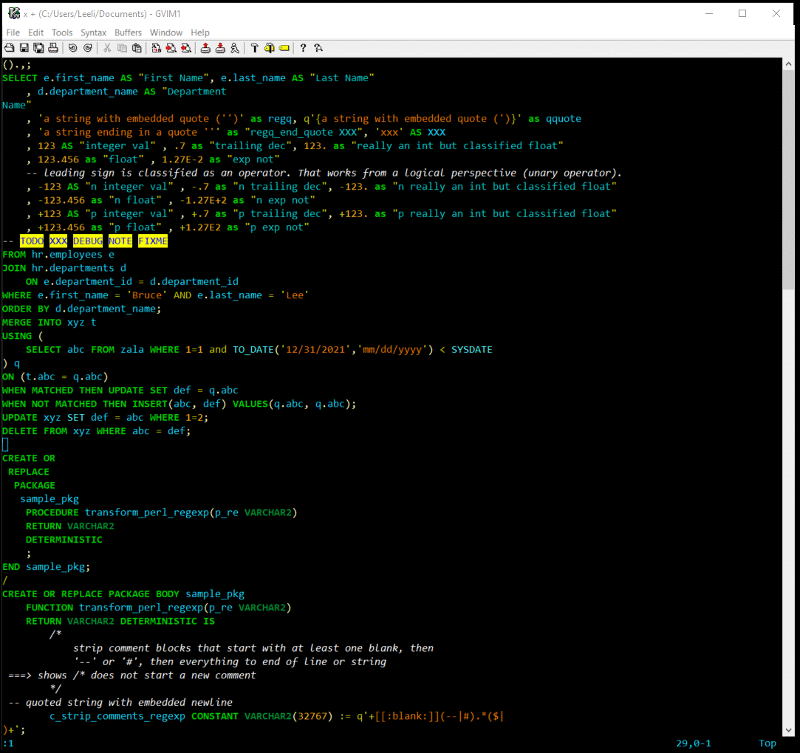
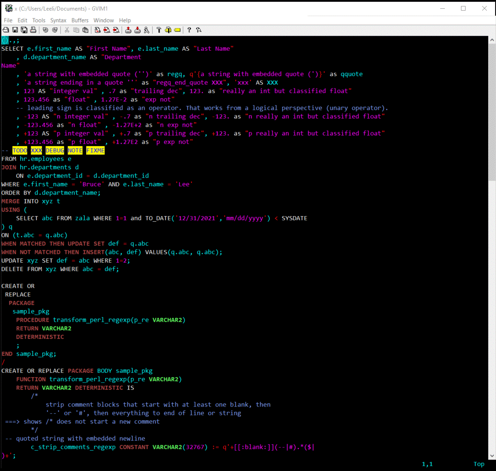
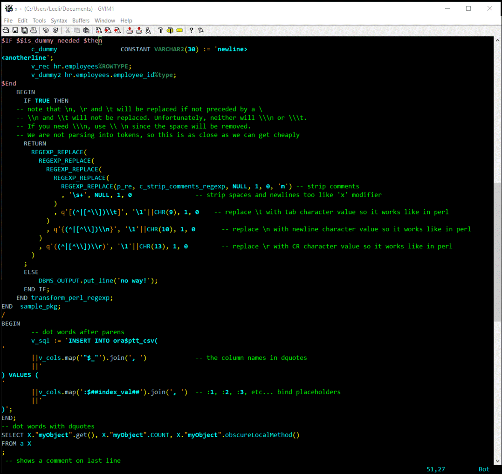
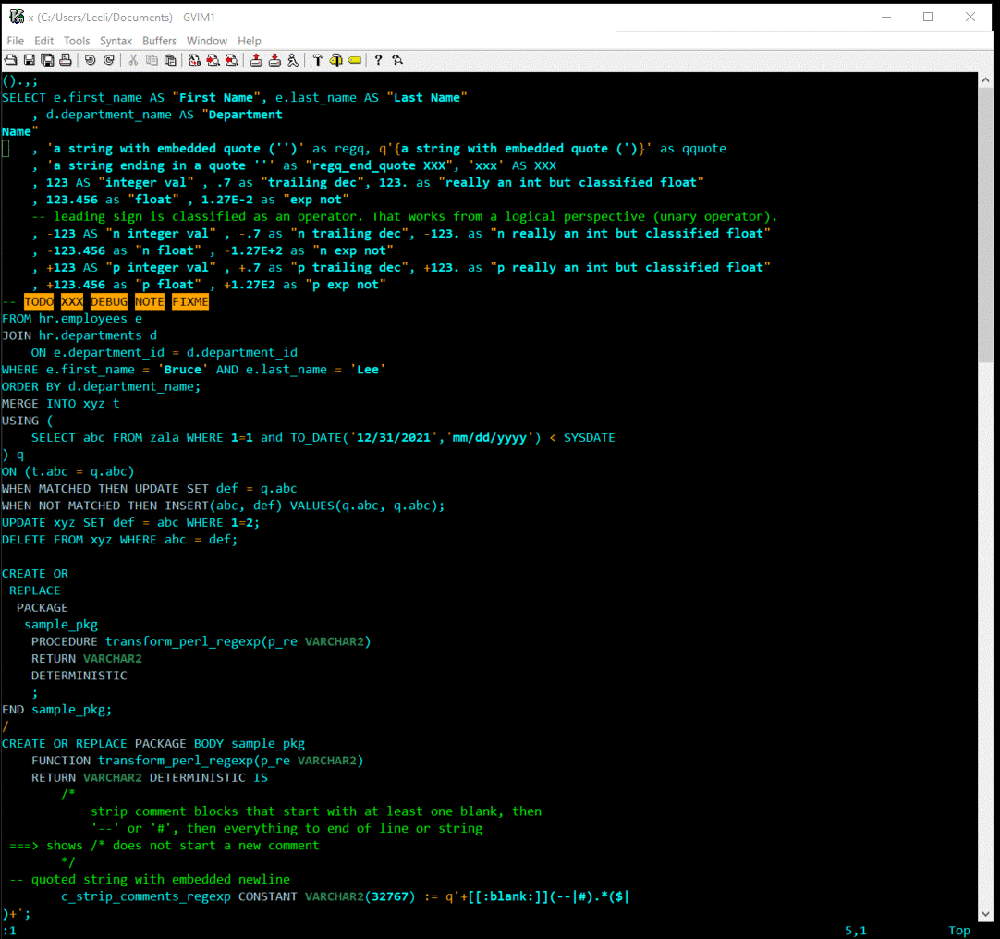
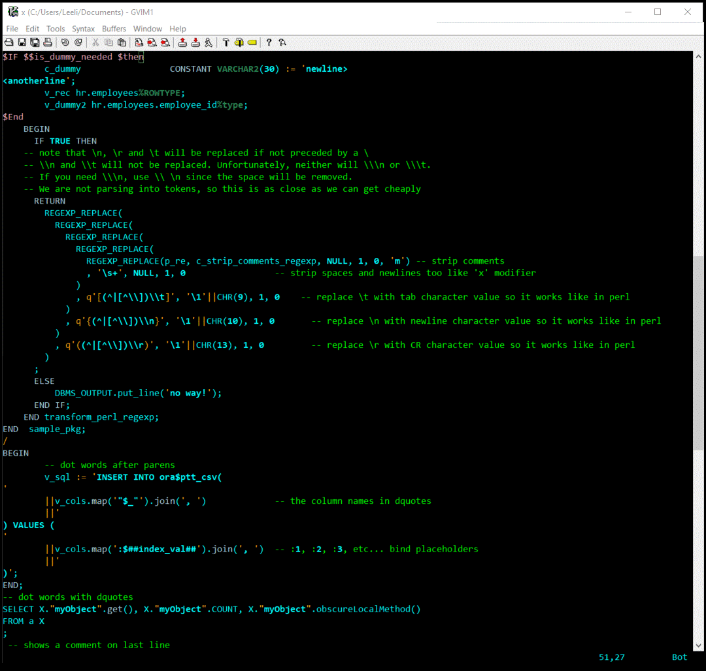

# vim_plsql_syntax

Provides for syntax highlighting of Oracle SQL and PL/SQL files in *vim*.

Repository includes

    syntax/plsql.vim
    colors/lee.vim

## plsql.vim syntax file

The syntax file replaces the functionality of the *plsql.vim* file that ships with vim (it was last updated
for Oracle 9). 

> NOTE: This file was submitted to the *vim* maintainers for inclusion in *vim* version 9.

This update adds keywords and syntax through Oracle version 19c.
It also fixes Q-quote operator syntax, exponential notation and assorted oddities. It does away
with trying to separate SQL from PL/SQL keywords unless *plsql_legacy_sql_keywords* is set.


Behavior was changed for highlight groups *plsqlSymbol* and *plsqlSQLKeyword*. If you want the
original behavior, add the following to your *.vimrc* file:


```vim
let plsql_legacy_sql_keywords = 1
```

### Folding

To turn on syntax folding, issue the following commands to enable folding and reload the syntax file:

```vim
:let plsql_fold = 1
:set syntax=plsql
```

In the installation section there are some suggestions for your *.vimrc* file, including how to turn
on folding automatically without having to open all folds every time you open a file.

Folding is defined for

* multi-line comments
* multi-line string literals including those created with the Q-quote operator
* BEGIN ... END; blocks including those that encompass the body of a procedure
* CASE ... END conditional blocks, both SQL and PL/SQL (END CASE;)
* IF ... END IF; conditional blocks
* LOOP ... END LOOP; repeat blocks

There is an option to turn on folding that attempts to parse PROCEDURE/FUNCTION; however, it turns
out to be difficult and I was not successful. Specifically, a BEGIN ... END; block inside a procedure
body BEGIN ... END; block was not achievable with the techniques I was able to understand from the documentation.
If an expert would like to take a wack at it, send me a pull request. I know how to torture it!

## lee.vim color file

The colors file *lee.vim* is a Black background theme.

*lee.vim* provides separate
colors for *Numbers* and *Boolean*, *Constant* (strings) and *Character* (double quoted identifiers) while the common color files
combine them. 

The rational for separating *Character* to a different color is that double quoted literal strings are mapped to *Character*.
Double Quoted literals in SQL are identifiers (object names) that are case sensitive and may contain spaces. Since they are really
table and column names, or column aliases, in your program rather than string literal data, they deserve a color
closer to what you use for *Normal*. *lee.vim* makes them Cyan which is close to the Electric Blue of *Normal*.

*lee.vim* folds *Repeat* and *Conditional* groups into *Statement* while the common color files show them in a
different color.

I use the same color scheme via 
a [ruby-rouge plsql lexer](https://lee-lindley.github.io/plsql/sql/2022/03/20/Ruby-Rouge-Lexer-PLSQL.html) 
in [my blog](https://lee-lindley.github.io/).

# Screenshots

## New PL/SQL syntax file with *lee.vim* color file

SQL and PL/SQL keywords are the same color. You can choose separate colors for Oracle
Reserved keywords from Oracle non-Reserved keywords if desired (Statement, Keyword), but we do not try to
separate SQL and PL/SQL keywords. The original implementation did so without considering context (which
would greatly complicate the lexer), and the result seems more distracting than useful.  You can get it back
with the *legacy* setting discussed above if you prefer it.

| Screenshots - 1 |
|:--:|
|  |
|  |

## Original PL/SQL syntax file with *lee.vim* color file

Notice the distinction between some SQL keywords and others. Also note some parsing is broken, in
particular the Q-quote operator (q'!text!').

| Screenshots - 2 |
|:--:|
|  |
|  |

## New PL/SQL syntax file using legacy setting with *lee.vim* color file

Much of it matches up with the original with better parsing of literals and
support for more Oracle syntax and keywords.

| Screenshots - 3 |
|:--:|
|  |
|  |

## New PL/SQL syntax file with *elflord.vim* color file

| Screenshots - 4 |
|:--:|
|  |
|  |

## Original PL/SQL syntax file with *elflord.vim* color file

| Screenshots - 5 |
|:--:|
|  |
|  |

## New PL/SQL syntax file using legacy setting with *elflord.vim* color file

| Screenshots - 6 |
|:--:|
|  |
|  |

## New PL/SQL syntax file with *ron.vim* color file

| Screenshots - 7 |
|:--:|
|  |
|  |

## Original PL/SQL syntax file with *ron.vim* color file

| Screenshots - 8 |
|:--:|
|  |
|  |

## New PL/SQL syntax file using legacy setting with *ron.vim* color file

| Screenshots - 9|
|:--:|
|  |
|  |

# Installation

The files are placed under your home directory. Do not put them in the common location under Program Files or /usr/local/share
because those can be clobbered by a reinstall or upgrade of vim.

If you are on Unix, create directories *~/.vim/syntax* and *~/.vim/colors* if they do not already exist. On windows it is your
%USERPROFILE% folder (usually C:\Users\YourLoginName) and below that *vimfiles/syntax*, *vimfiles/colors*.

These configuration files can be used independently. *plsql.vim* works just fine with *elflord* and other
color schemes that ship with vim. *lee.vim* uses some highlight groups the common color files do not
while folding together some that the common color groups separate. This is discussed at the top of the document.

You might want to add the following to your *.vimrc* (or *_vimrc* file on windows):

```vim
syntax enable
colorscheme lee
au BufNewFile,BufRead *.sql,*.pls,*.tps,*.tpb,*.pks,*.pkb,*.pkg,*.trg syntax on
au BufNewFile,BufRead *.sql,*.pls,*.tps,*.tpb,*.pks,*.pkb,*.pkg,*.trg set filetype=plsql
```

If you want to turn on folding, and optionally open all folds when the file is loaded (default
when you turn on folding is to start with all folds closed), add the following to *.vimrc* before the BufRead lines:

```vim
let plsql_fold = 1
au Syntax plsql normal zR
```

The [manual page](https://vimhelp.org/syntax.txt.html#%3Asyn-files) may be helpful. See
*MAKING YOUR OWN SYNTAX FILES*.

